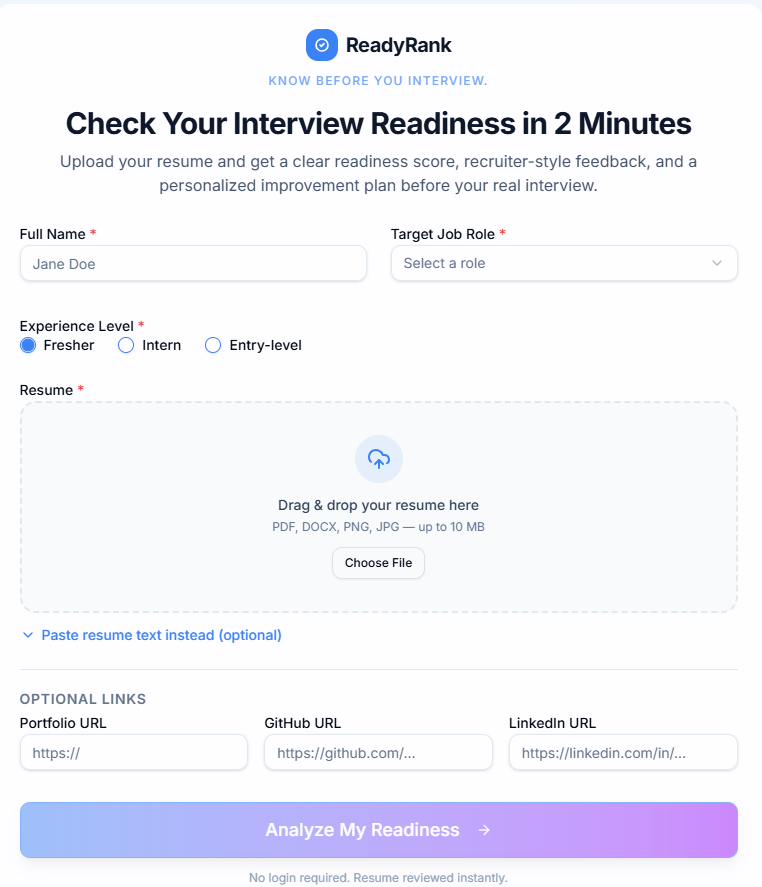

# ReadyRank – Interview Readiness Analyzer

ReadyRank is a smart interview readiness assessment tool designed to help students evaluate their preparation before facing real recruiters. It analyzes a candidate’s resume and profile, generates an overall readiness score, highlights strengths and weaknesses, and provides a personalized improvement plan.

## Overview

Every year, millions of students enter the job market without knowing whether they are truly prepared for interviews. Many discover gaps in their resume, technical skills, communication, or portfolio only after failed interviews.

ReadyRank solves this problem by giving students a fast, simple, and objective way to measure their interview readiness in under 2 minutes.

## Problem Statement

Design and develop a solution that evaluates different aspects of interview preparation, including:

- Technical skills
- Resume quality
- Communication gaps
- Project and portfolio strength
- Job role fit

The tool provides an overall **Interview Readiness Score** along with actionable feedback and a personalized improvement roadmap.

## Features

-  Resume upload support
-  Smart readiness evaluation
-  Interview Readiness Score out of 100
-  Category-wise score breakdown
-  Recruiter-style first impression
-  Strengths and weaknesses analysis
-  Priority improvement suggestions
-  7-day interview preparation plan
-  Suggested practice interview questions
-  Downloadable readiness report
-  Responsive and user-friendly interface

## Evaluation Categories

ReadyRank evaluates candidates across five major categories:

| Category | Weight |
|---|---:|
| Resume Quality | 25 |
| Technical Skills Match | 25 |
| Project/Portfolio Strength | 20 |
| Communication & Presentation | 15 |
| Job Role Fit | 15 |

## Readiness Levels

| Score Range | Level |
|---|---|
| 0–40 | Not Ready |
| 41–70 | Almost Ready |
| 71–85 | Interview Ready |
| 86–100 | Strong Candidate |

## Tech Stack

- **Frontend:** React
- **Styling:** Tailwind CSS
- **Backend/API:** Node.js / Express or Replit server
- **AI Integration:** Gemini API
- **Resume Processing:** PDF/DOCX/Image text extraction
- **Deployment:** Replit / GitHub

## How It Works

1. User enters basic details such as name, target role, and experience level.
2. User uploads a resume or pastes resume text.
3. The app extracts resume content.
4. The system calculates a deterministic readiness score.
5. The Smart Readiness Engine generates personalized feedback.
6. The user receives a complete Interview Readiness Report.

## Key Idea

ReadyRank combines rule-based scoring with personalized report generation.

The score is calculated using predefined evaluation logic to keep results consistent and fair. Personalized feedback is then generated based on the resume content, selected role, and category-wise scores.

This approach helps avoid random scoring while still giving each student a useful and customized improvement plan.

## Screenshots

project screenshots here:

## Demo Video

Watch the live working demo of ReadyRank here:

[Click here to watch the demo](https://drive.google.com/file/d/1WnBMbQMwn_MGk2GT68fsq6l5KR0xa7un/view?usp=sharing)

**## Live Demo**

Try the live project here:

[Open ReadyRank](https://interview-ready-ai--vijaymahalaxmi5.replit.app/)
